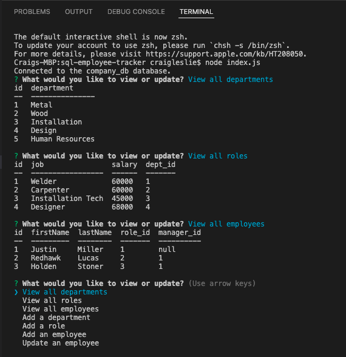

# sql-employee-tracker

## Description

This app allows the user to view or update data in a sql database for their employees, roles, and departments.
------------------------------

## Table of Contents

1. [Installation](#installation)
2. [Usage Information](#usage)
3. [Contribution Guidelines](#contribution)
4. [Test Instructions](#test)
5. [Questions](#questions)
6. [License](#license)

------------------------------

## Installation 

* Type npm install
* Type node index.js

## Usage Information 

This program's intended purpose is to provide a simple application that displays the current departments, current jobs in the company, and all the current employees. It also allows the user to add a job, add an employee, or update an employee.

## Contribution Guidelines 

* Report any bugs to the email below.
* If your code is complicated, use comments.
* Any major changes must be approved by the repo-manager.
* Be respectful.

## Test Instructions 

There are no tests creaeted for this app.

## Screenshot and walkthrough Video

* [Walkthrough Video](https://drive.google.com/file/d/1Tm1YcWgqblgAaiVGc5nm8XkWcfcDXrgU/view)

## Licenses 

* The MIT License

## Questions 

* [GitHub](github.com/3roses) 
* [Email](mailto:cleslie25@gmail.com)
